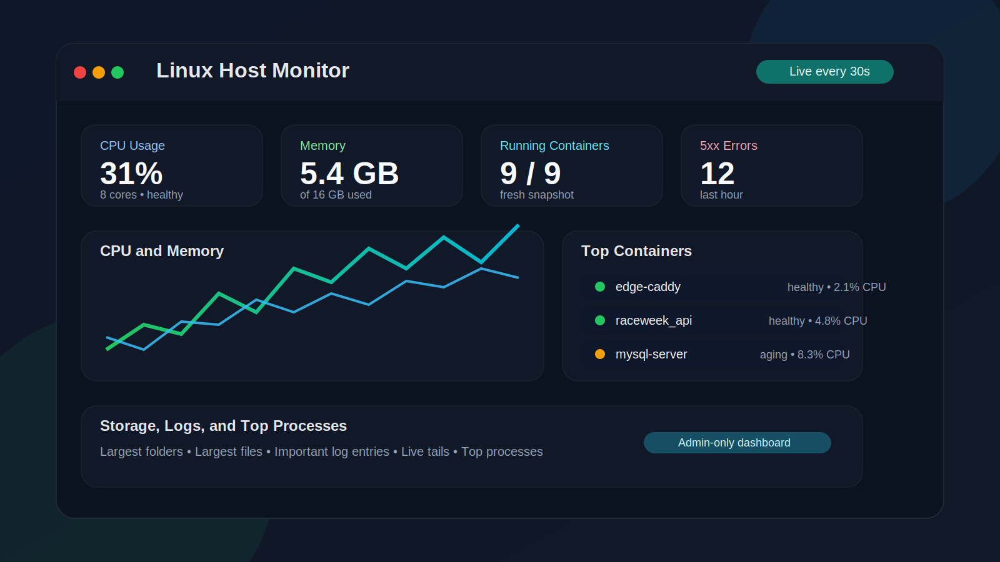

# Linux Host Monitor for Ubuntu


Lightweight self-hosted monitoring for Ubuntu and other Linux Docker hosts, focused on host health, container visibility, storage diagnostics, and optional log analytics.

## Screenshot



## Overview

Linux Host Monitor for Ubuntu is a lightweight monitoring dashboard for Linux machines that run Docker.

It ships as a single container with:

- nginx serving the frontend on port 8080
- a Node.js API for collection and aggregation
- a local JSON-backed store for lightweight history

The project is designed to stay simple:

- no external database
- no npm runtime dependencies
- no built-in Firebase or OTP authentication layer
- no production-specific domains or host paths in the published package

## Highlights

- single-container deployment
- host and container observability in one page
- optional reverse-proxy log analytics
- config explorer for mounted Compose and Caddy files
- admin-focused design without bundled auth lock-in

## What It Monitors

### Host metrics

- CPU usage
- memory usage
- disk usage
- network RX and TX
- uptime and load average

### Docker metrics

- running containers
- container CPU and memory
- restart count
- health state
- image names
- last-seen freshness information

### Optional log-based insights

- request trends from JSON access logs
- top URLs and top client IPs
- HTTP error breakdowns
- important container log entries
- live tails for selected containers

### Storage and process visibility

- largest root folders
- largest files
- storage growth trends
- top host processes

## Features

- range-aware dashboard views
- lightweight host polling every 30 seconds
- slower full snapshot collection every 3 minutes
- historical snapshot compaction to reduce memory usage
- config explorer for mounted `docker-compose.yml`, `compose.yml`, and `Caddyfile`
- standalone Docker Compose example for the monitoring container only
- minimal Caddy reverse-proxy example

## Requirements

- Ubuntu or another Linux distribution
- Docker Engine
- Docker Compose plugin (`docker compose`)
- Git
- access to `/var/run/docker.sock`
- readable host mounts for `/proc`, `/sys`, and `/`

Optional:

- a directory with JSON access logs
- access to `/var/lib/docker/containers` for important log entries and live tails
- a reverse proxy such as Caddy

There is no separate `npm install` or `pip install` step for normal usage.

The application runtime is built inside the Docker image, and `requirements.txt` exists only to document that there are no Python package dependencies for this repository.

## Quick Start

### 1. Install host prerequisites

On Ubuntu, install the basic tools first if they are not already available:

```bash
sudo apt update
sudo apt install -y git ca-certificates curl
```

Install Docker Engine and the Docker Compose plugin if needed.

After installation, confirm these commands work:

```bash
docker --version
docker compose version
git --version
```

### 2. Clone the repository on the Linux host

```bash
cd /opt
sudo git clone https://github.com/willian2501/monitoring_tool_for_ubuntu.git linux-host-monitor
cd linux-host-monitor
```

If you prefer a different folder, that is fine. The docs use `/opt/linux-host-monitor` as the example path.

### 3. Review what does and does not need to be installed

- you do not need to run `npm install`
- you do not need to run `pip install -r requirements.txt`
- you do not need Node.js or Python installed on the host just to run the container

The Docker build handles the application runtime for you.

### 4. Create the environment file

```bash
cd /opt/linux-host-monitor/docker-compose
cp .env.example .env
```

### 5. Edit the host-specific values

```bash
nano /opt/linux-host-monitor/docker-compose/.env
```

At minimum, review:

- `MONITORING_PORT`
- `HOST_CADDY_LOG_DIR`
- `HOST_CONTAINER_LOG_ROOT`
- `CONFIG_ROOT_PATH`
- `SELECTED_LOG_CONTAINERS`

If you do not use Caddy, you can still run the tool. Access-log panels will simply stay empty unless `HOST_CADDY_LOG_DIR` points to JSON logs.

### 6. Start the container

```bash
cd /opt/linux-host-monitor/docker-compose
docker compose -f docker-compose.monitoring.yml up -d --build
```

### 7. Confirm the container is running

```bash
docker compose -f /opt/linux-host-monitor/docker-compose/docker-compose.monitoring.yml ps
docker logs monitoring_tool --tail 50
```

### 8. Open the dashboard

Open `http://<host>:8080` or the port defined by `MONITORING_PORT`.

If you placed it behind a reverse proxy, open the configured hostname instead.

## Configuration

The main environment template is in `docker-compose/.env.example`.

Important variables:

- `MONITORING_PORT`
- `HOST_CADDY_LOG_DIR`
- `HOST_CONTAINER_LOG_ROOT`
- `CONFIG_ROOT_PATH`
- `DATA_RETENTION_DAYS`
- `COLLECTION_INTERVAL_MS`
- `HOST_COLLECTION_INTERVAL_MS`
- `SELECTED_LOG_CONTAINERS`
- `SERVICE_PROBES`

Default runtime tuning:

- `DATA_RETENTION_DAYS=7`
- `COLLECTION_INTERVAL_MS=180000`
- `HOST_COLLECTION_INTERVAL_MS=30000`

## Security

This dashboard mounts privileged host resources.

If you expose it outside a private network, place it behind external authentication such as:

- Cloudflare Access
- reverse-proxy authentication
- a VPN

The project intentionally does not ship its own login screen.

## Repository Layout

- `src/` application backend
- `public/` frontend assets
- `nginx/` nginx config
- `docker/` container entrypoint
- `docker-compose/` standalone Compose example and env template
- `caddy/` optional reverse-proxy example
- `cloudflare/` optional access-control guidance
- `Setup_custom_tool.md` deployment notes
- `KNOWN_ME.md` operator-focused quick notes

## Documentation

- `Setup_custom_tool.md` for installation and deployment
- `CONTRIBUTING.md` for contribution rules
- `SECURITY.md` for security guidance

## Notes

- host cards can update between full snapshots, but container and log freshness still follows the full snapshot cycle
- the package is generic for Linux Docker hosts, not for non-Docker environments
- access-log analytics work only when the mounted log directory actually contains JSON logs
