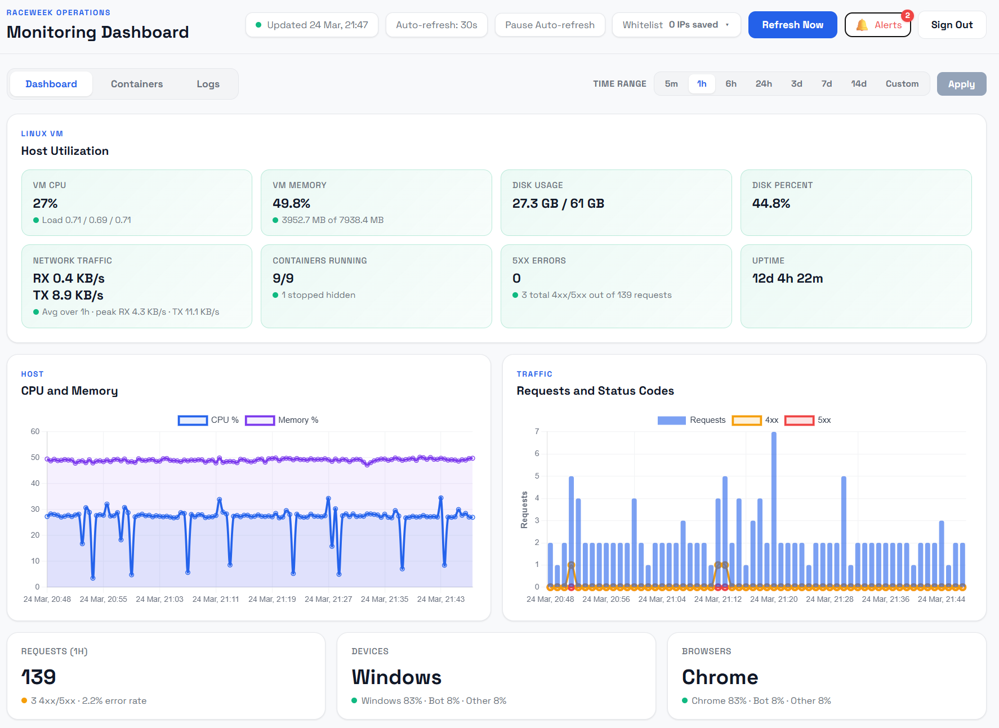

# Linux Host Monitor for Ubuntu


Lightweight self-hosted monitoring for Ubuntu and other Linux Docker hosts, focused on host health, container visibility, storage diagnostics, and optional log analytics.

## Screenshot



Example dashboard layout showing host summary cards, time-range controls, CPU and memory charts, traffic charts, and request summary cards.

## Overview

Linux Host Monitor for Ubuntu is a lightweight monitoring dashboard for Linux machines that run Docker.

It ships as a single container with:

- nginx serving the frontend on port 8080
- a Node.js API for collection and aggregation
- a local JSON-backed store for lightweight history

The project is designed to stay simple:

- no external database
- no npm runtime dependencies
- no built-in Firebase or OTP authentication layer
- no production-specific domains or host paths in the published package

## Highlights

- single-container deployment
- host and container observability in one page
- optional reverse-proxy log analytics
- config explorer for mounted Compose and Caddy files
- admin-focused design without bundled auth lock-in

## What It Monitors

### Host metrics

- CPU usage
- memory usage
- disk usage
- network RX and TX
- uptime and load average

### Docker metrics

- running containers
- container CPU and memory
- restart count
- health state
- image names
- last-seen freshness information

### Optional log-based insights

- request trends from JSON access logs
- top URLs and top client IPs
- HTTP error breakdowns
- important container log entries
- live tails for selected containers

### Storage and process visibility

- largest root folders
- largest files
- storage growth trends
- top host processes

## Features

- range-aware dashboard views
- lightweight host polling every 30 seconds
- slower full snapshot collection every 3 minutes
- historical snapshot compaction to reduce memory usage
- config explorer for mounted `docker-compose.yml`, `compose.yml`, and `Caddyfile`
- standalone Docker Compose example for the monitoring container only
- minimal Caddy reverse-proxy example

## Requirements

- Ubuntu or another Linux distribution
- Docker Engine
- Docker Compose plugin (`docker compose`)
- Git
- access to `/var/run/docker.sock`
- readable host mounts for `/proc`, `/sys`, and `/`

Optional:

- a directory with JSON access logs
- access to `/var/lib/docker/containers` for important log entries and live tails
- a reverse proxy such as Caddy

There is no required `npm install` step for normal usage.

The application runtime is built inside the Docker image. The `requirements.txt` file is currently empty and exists mainly for tooling or platforms that expect a dependency-install step.

## Install and Quick Start

### 1. Install host prerequisites

On Ubuntu, install the base packages first:

```bash
sudo apt update
sudo apt install -y git ca-certificates curl python3 python3-pip python3-venv
```

For Docker, use one of these approaches:

- if Docker is already installed and `docker compose version` works, keep your current installation
- if you use Ubuntu's packages, install `docker.io` and a compatible Compose package from Ubuntu
- if you use Docker's official apt repository, install Docker packages from that repository only

Do not mix Ubuntu's `docker.io` package with Docker upstream packages like `containerd.io`.

If you are using Docker's official repository, install Docker like this:

```bash
sudo apt update
sudo apt install -y docker-ce docker-ce-cli containerd.io docker-buildx-plugin docker-compose-plugin
```

After installation, confirm these commands work:

```bash
docker --version
docker compose version
git --version
python3 --version
python3 -m pip --version
```

### 2. Clone the repository on the Linux host

```bash
cd /opt
sudo git clone https://github.com/willian2501/monitoring_tool_for_ubuntu.git linux-host-monitor
cd linux-host-monitor
```

If you prefer a different folder, that is fine. The docs use `/opt/linux-host-monitor` as the example path.

### 3. Install the documented requirements step

If your checklist expects a requirements command, run it after cloning:

```bash
cd /opt/linux-host-monitor
python3 -m venv .venv
. .venv/bin/activate
pip install -r requirements.txt
```

Right now this installs nothing because the file is intentionally empty.

Do not run `pip install -r requirements.txt` directly against the system Python on Ubuntu 24.04+.

If you do not want to activate the virtual environment, use the venv pip explicitly:

```bash
cd /opt/linux-host-monitor
python3 -m venv .venv
.venv/bin/pip install -r requirements.txt
```

### 4. Review what does and does not need to be installed

- you do not need to run `npm install`
- you do not need Node.js or Python installed on the host just to run the container
- the virtualenv `pip install -r requirements.txt` step is optional and currently installs nothing

The Docker build handles the application runtime for you.

### 5. Create the environment file

```bash
cd /opt/linux-host-monitor/docker-compose
cp .env.example .env
```

### 6. Edit the host-specific values

```bash
nano /opt/linux-host-monitor/docker-compose/.env
```

At minimum, review:

- `MONITORING_PORT`
- `HOST_CADDY_LOG_DIR`
- `HOST_CONTAINER_LOG_ROOT`
- `CONFIG_ROOT_PATH`
- `SELECTED_LOG_CONTAINERS`

If you do not use Caddy, you can still run the tool. Access-log panels will simply stay empty unless `HOST_CADDY_LOG_DIR` points to JSON logs.

### 7. Start the container

```bash
cd /opt/linux-host-monitor/docker-compose
docker compose -f docker-compose.monitoring.yml up -d --build
```

### 8. Confirm the container is running

```bash
docker compose -f /opt/linux-host-monitor/docker-compose/docker-compose.monitoring.yml ps
docker logs monitoring_tool --tail 50
```

### 9. Open the dashboard

Open `http://<host>:8080` or the port defined by `MONITORING_PORT`.

If you placed it behind a reverse proxy, open the configured hostname instead.

## Configuration

The main environment template is in `docker-compose/.env.example`.

Important variables:

- `MONITORING_PORT`
- `HOST_CADDY_LOG_DIR`
- `HOST_CONTAINER_LOG_ROOT`
- `CONFIG_ROOT_PATH`
- `DATA_RETENTION_DAYS`
- `COLLECTION_INTERVAL_MS`
- `HOST_COLLECTION_INTERVAL_MS`
- `SELECTED_LOG_CONTAINERS`
- `SERVICE_PROBES`

Default runtime tuning:

- `DATA_RETENTION_DAYS=7`
- `COLLECTION_INTERVAL_MS=180000`
- `HOST_COLLECTION_INTERVAL_MS=30000`

Key configuration notes:

- `HOST_CADDY_LOG_DIR` should point to a directory that contains JSON access logs if you want request analytics
- `HOST_CONTAINER_LOG_ROOT` defaults to the standard Docker Engine container log path
- `CONFIG_ROOT_PATH` is the path inside the container used by the config explorer; because the host root is mounted at `/host-root`, a host path like `/opt/my-stack` becomes `/host-root/opt/my-stack`
- `SELECTED_LOG_CONTAINERS` is optional and controls which containers appear in important-log and live-tail panels
- `SERVICE_PROBES` is optional and can be used for synthetic endpoint checks

## Deployment Notes

This repository ships a standalone Compose file for the monitoring container only.

It does not replace your existing application stack.

After starting the container, verify it is healthy:

```bash
docker compose -f /opt/linux-host-monitor/docker-compose/docker-compose.monitoring.yml ps
docker logs monitoring_tool --tail 50
```

## Reverse Proxy

The bundled Caddy file is a minimal example site block, not a full server-wide Caddyfile.

Use `caddy/Caddyfile.monitoring-phase1.snippet` as a starting point and set:

- `MONITORING_DOMAIN`
- `CADDY_ACME_EMAIL`

The example proxies traffic to `monitoring_tool:8080` and writes JSON access logs to `/var/log/caddy/monitoring-access.log`.

If your reverse proxy runs outside the same Docker network, change the upstream target to the host and published port instead.

## Access Control

This published package no longer includes Firebase login or OTP.

If the dashboard is reachable from the public internet, place it behind external authentication such as:

- Cloudflare Access
- reverse-proxy authentication
- a VPN

Reference notes are in `cloudflare/access-setup.md`.

## Validation

After deployment, confirm:

1. the dashboard loads without a built-in login screen
2. host cards show CPU, RAM, disk, and network
3. container rows appear
4. request charts populate if your access-log directory contains JSON logs
5. important logs and live tails appear for containers listed in `SELECTED_LOG_CONTAINERS`

If request charts stay empty, verify that `HOST_CADDY_LOG_DIR` points to a real directory with JSON log files.

## Troubleshooting

### `python3 -m pip install -r requirements.txt` fails with `No module named pip`

Install `pip` first:

```bash
sudo apt update
sudo apt install -y python3-pip
python3 -m pip --version
```

Then rerun:

```bash
cd /opt/linux-host-monitor
python3 -m venv .venv
. .venv/bin/activate
pip install -r requirements.txt
```

### `python3 -m pip install -r requirements.txt` fails with `externally-managed-environment`

This is expected on newer Ubuntu releases that enforce PEP 668 for the system Python environment.

Do not use `--break-system-packages` for this repository.

Do not run bare `pip install -r requirements.txt` either, because that still targets the system-managed Python environment unless you are inside an activated virtual environment.

Use a virtual environment instead:

```bash
sudo apt update
sudo apt install -y python3-venv python3-pip
cd /opt/linux-host-monitor
python3 -m venv .venv
. .venv/bin/activate
pip install -r requirements.txt
```

For this repository, that command still installs nothing because `requirements.txt` is intentionally empty.

If you prefer not to activate the environment, this is also valid:

```bash
cd /opt/linux-host-monitor
python3 -m venv .venv
.venv/bin/pip install -r requirements.txt
```

### `docker compose` is not found

Install Docker and the Compose plugin using one package source only.

If you are using Docker's official repository:

```bash
sudo apt update
sudo apt install -y docker-ce docker-ce-cli containerd.io docker-buildx-plugin docker-compose-plugin
docker --version
docker compose version
```

If you are using Ubuntu's repository instead, install Docker packages from Ubuntu only and avoid Docker upstream packages.

### `containerd.io` conflicts with `containerd`

This happens when Ubuntu's `docker.io` package is mixed with Docker's official packages.

Use one source or the other, not both.

If Docker's official repository is already configured on the machine, prefer:

```bash
sudo apt update
sudo apt install -y docker-ce docker-ce-cli containerd.io docker-buildx-plugin docker-compose-plugin
```

Do not install `docker.io` in that case.

### `docker compose up` fails because Docker is not running

Start and enable the Docker service:

```bash
sudo systemctl enable --now docker
sudo systemctl status docker
```

### Permission errors when accessing Docker

If you are not running as root, add your user to the `docker` group and start a new shell session:

```bash
sudo usermod -aG docker "$USER"
newgrp docker
docker ps
```

### The dashboard opens but container data is empty

Check that the Docker socket is mounted and readable inside the container:

```bash
docker inspect monitoring_tool --format '{{json .Mounts}}'
docker logs monitoring_tool --tail 100
```

Make sure `/var/run/docker.sock` exists on the host.

### Host metrics look empty or broken

Confirm these host mounts are present in the running container:

- `/proc` mounted to `/host/proc`
- `/sys` mounted to `/host/sys`
- `/` mounted to `/host-root`

You can inspect mounts with:

```bash
docker inspect monitoring_tool --format '{{json .Mounts}}'
```

### Request charts stay empty

This usually means `HOST_CADDY_LOG_DIR` does not point to JSON access logs.

Check the value in `docker-compose/.env`, then confirm files exist on the host:

```bash
ls -lah /var/log/caddy
docker logs monitoring_tool --tail 100
```

If you do not use Caddy or do not mount JSON logs, the dashboard still works, but request analytics remain empty.

### Important logs and live tails are empty

Check `SELECTED_LOG_CONTAINERS` in `docker-compose/.env`.

Only containers listed there are used for important-log and live-tail panels.

Also confirm the host log root exists:

```bash
ls -lah /var/lib/docker/containers
```

### The config explorer shows nothing

Check `CONFIG_ROOT_PATH` in `docker-compose/.env`.

Because the host root is mounted to `/host-root`, a host directory like `/opt/my-stack` must be configured as:

```text
CONFIG_ROOT_PATH=/host-root/opt/my-stack
```

### The container starts and exits immediately

Inspect the logs first:

```bash
docker logs monitoring_tool --tail 200
```

Then rebuild from scratch if needed:

```bash
cd /opt/linux-host-monitor/docker-compose
docker compose -f docker-compose.monitoring.yml down
docker compose -f docker-compose.monitoring.yml up -d --build
```

### Port `8080` is already in use

Change `MONITORING_PORT` in `docker-compose/.env` to another host port, for example:

```text
MONITORING_PORT=8090
```

Then recreate the container.

## Retention

The tool keeps data intentionally short:

- 7 days of snapshots
- 7 days of access rollups
- 7 days of stored important log events

Live tail panels are read on demand from current Docker log files.

## Security

This dashboard mounts privileged host resources.

If you expose it outside a private network, place it behind external authentication such as:

- Cloudflare Access
- reverse-proxy authentication
- a VPN

The project intentionally does not ship its own login screen.

## Repository Layout

- `src/` application backend
- `public/` frontend assets
- `nginx/` nginx config
- `docker/` container entrypoint
- `docker-compose/` standalone Compose example and env template
- `caddy/` optional reverse-proxy example
- `cloudflare/` optional access-control guidance
- `requirements.txt` optional empty dependency manifest for tooling compatibility

## Documentation

- `CONTRIBUTING.md` for contribution rules
- `SECURITY.md` for security guidance

## Notes

- host cards can update between full snapshots, but container and log freshness still follows the full snapshot cycle
- the package is generic for Linux Docker hosts, not for non-Docker environments
- access-log analytics work only when the mounted log directory actually contains JSON logs
